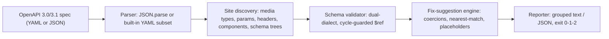

# examplint

[English](README.md) | [中文](README.zh.md) | [日本語](README.ja.md)

[](LICENSE)   [](CONTRIBUTING.md)

**OpenAPI 仕様内のすべての example を、宣言されたスキーマに照らして検証するオープンソース・ゼロ依存の linter——不一致ごとに具体的な修正提案を添えて。**


```bash
# not yet on npm — install from a checkout of this repository
npm install && npm run build && npm pack
npm install -g ./examplint-0.1.0.tgz
```

## なぜ examplint？

仕様の example は静かに腐っていきます。フィールドが改名され、enum 値が記憶頼りに打ち直され、マージの際に整数へ引用符が付く——それでもレビューは通ります。example は OpenAPI ドキュメントの中で唯一、何も実行しない部分だからです。腐敗はそのまま下流の利用者全員へ流れます：生成ドキュメントは 400 になるリクエストを掲載し、モックサーバーは検証を通らないペイロードを SDK に渡し、最初に気づくのは顧客です。汎用の仕様 linter は構造とスタイルが主眼で、example を検査する場合も「スキーマに合致しない」で止まります。examplint はひとつの仕事を完全にやり切ります：ドキュメント内の**すべての** example——メディアタイプ、名前付き `examples` マップ、パラメータ、ヘッダー、`components`、webhook、そして他ツールが素通りするスキーマ直下の `example`/`examples`/`default` 値——を見つけ出し、それぞれを管轄する正確なスキーマに照らして検証し、各指摘に具体的な修正（`did you mean "available"?`、`unquote it: 25`、`add "status": "available"`）を添えます。検査できないものはコード付き警告として理由を明示し、黙ってスキップすることはありません。

|  | examplint | Spectral | openapi-examples-validator | Redocly CLI |
|---|---|---|---|---|
| フォーカス | example とスキーマの整合のみ | 汎用ルールセット lint | example 検証 | フル API ツールチェーン |
| 修正提案 | 導出可能な指摘すべてに | なし | なし | なし |
| スキーマ直下の `example`/`examples[]` | あり、スキーマ木の任意の深さ | トップレベルの schema example ルールのみ | フラグで有効化 | 部分的 |
| `default` 値の検証 | あり（`--check-defaults`） | なし | なし | なし |
| 未検査 example の開示 | 常にコード付き警告で | なし | なし | なし |
| 必要な設定 | 不要 | ルールセットファイル | CLI フラグ | 設定ファイル |
| ランタイム依存 | 0 | 約 25 | 約 10 | 約 50 |

<sub>各機能・依存数は各プロジェクトの公開ドキュメントおよび npm メタデータで確認、2026-07。</sub>

## 機能

- **網羅的な example 発見** —— メディアタイプの `example`・`examples` マップ、パラメータ/ヘッダーの例、リクエストボディ、レスポンス、`components.*`、webhook、任意の深さに入れ子のスキーマ直下 `example`/`examples[]`；`examplint list` は見つけた全箇所を JSON Pointer 付きで表示します。
- **判定だけでなく修正提案** —— 打ち間違えた enum 値やプロパティ名は最も近い候補へ解決、引用符付きの数値は引用符除去を提案、欠けた必須プロパティにはスキーマ由来のプレースホルダ、format 不一致には有効なサンプル、`oneOf` 不成立には最も近い分岐を提示。
- **両方言を正しく** —— OpenAPI 3.0（`nullable`、真偽値 `exclusiveMaximum`、単一スキーマ `items`）と 3.1（型配列、`const`、`prefixItems`、`contains`）に対応し、循環ガード付き `$ref` 解決で再帰スキーマが再帰データを検証できます。
- **黙ってスキップしない** —— 外部参照、`externalValue` の例、非 JSON メディアタイプ、未知の format、スキーマなしの example は、それぞれ安定コードの警告（W201–W209）となり、未検査の理由を明示します。
- **CI のために** —— 決定的な出力、`--format json`、`--strict`、指摘（1）と用法エラー（2）を区別する終了コード；診断ごとに 2 つの位置（仕様内の site pointer、example 内の instance path）が付き、スクリプト処理もジャンプも容易です。
- **ランタイム依存ゼロ、完全オフライン** —— 必要なのは Node.js だけ；YAML/JSON の解析・検証・レポートはすべて同梱で、ツールがソケットを開くことはありません。

## クイックスタート

インストール：

```bash
# not yet on npm — install from a checkout of this repository
npm install && npm run build && npm pack
npm install -g ./examplint-0.1.0.tgz
```

同梱のドリフト版 petstore——半年間レビューされなかった編集——を検査：

```bash
examplint check examples/drifted.yaml
```

出力（実際の実行結果）：

```text
examples/drifted.yaml: 5 examples checked, 0 skipped

GET /pets → param limit → example
  at /paths/~1pets/get/parameters/0/example
  error E101: expected integer, got string "25"
      fix: unquote it: 25

GET /pets → 200 → application/json → examples.two-pets
  at /paths/~1pets/get/responses/200/content/application~1json/examples/two-pets/value
  error E102 at /0/status: "avialable" is not one of the 3 allowed values
      fix: did you mean "available"?
  error E101 at /1/id: expected integer, got string "2"
      fix: unquote it: 2
  error E107 at /1/taggs: property "taggs" is not declared in the schema and additionalProperties is false
      fix: did you mean "tags"?

POST /pets → requestBody → application/json → example
  at /paths/~1pets/post/requestBody/content/application~1json/example
  error E106: missing required property "status"
      fix: add "status": "available"

POST /pets → 201 → application/json → example
  at /paths/~1pets/post/responses/201/content/application~1json/example
  warning W203 at /adoptedAt: "yesterday" is not a valid date-time
      fix: a valid date-time looks like "2026-07-12T09:30:00Z"

components.schemas.Pet → example
  at /components/schemas/Pet/example
  error E103 at /id: 0 is < the minimum 1
      fix: use a value >= 1

examples/drifted.yaml: FAIL (6 errors, 1 warning)
```

終了コードは 1——そのまま CI に置けます。発見の全容を見るには（実際の実行結果）：

```bash
examplint list examples/drifted.yaml
```

```text
examples/drifted.yaml: 5 example sites
  GET /pets → param limit → example
    at /paths/~1pets/get/parameters/0/example [parameter-example]
  GET /pets → 200 → application/json → examples.two-pets
    at /paths/~1pets/get/responses/200/content/application~1json/examples/two-pets/value [named-example]
  ...
```

クリーンな双子 `examples/petstore.yaml` は `11 examples checked, 0 skipped` で終了コード 0 になります。その他のシナリオは [examples/](examples/README.md) を参照。

## ルール

エラー（E1xx）は example がスキーマに合致しないこと、警告（W2xx）は何かを完全には検査できなかったことを意味し——examplint は必ず理由を述べます。コードは安定 API で、番号の付け替えはありません。各ルールの詳細は [docs/rules.md](docs/rules.md) を参照。

| ルール | 重大度 | 検査内容 |
|---|---|---|
| E101 | error | 値の型とスキーマの `type`（3.0 `nullable`、3.1 型配列を含む） |
| E102 | error | `enum` への所属と `const` の一致 |
| E103 | error | `minimum`/`maximum`/`exclusive*`/`multipleOf` |
| E104 | error | `minLength`/`maxLength`/`pattern` |
| E105 | error | `min/maxItems`、`uniqueItems`、`contains` |
| E106 | error | `required`、`dependentRequired`、プロパティ数、`propertyNames` |
| E107 | error | `additionalProperties: false` 下の未宣言プロパティ |
| E108 | error | `oneOf`/`anyOf`/`not` の合成 |
| W201–W209 | warning | 検査できなかったすべて、各件に理由付き |

## CLI リファレンス

`examplint check <spec...>` が検証（パスだけでも動作）；`examplint list <spec...>` が発見箇所を列挙。JSON か YAML かは内容から判別——内蔵の YAML サブセットは現実の仕様の書き方をカバーし、アンカー/タグ/マルチドキュメントは明示的に拒否します（[docs/yaml-support.md](docs/yaml-support.md) 参照）。

| フラグ | 既定値 | 効果 |
|---|---|---|
| `--format text\|json` | `text` | レポート形式；JSON は CI 向けの安定した構造 |
| `--strict` | オフ | 警告でも失敗させる（終了コード 1） |
| `--check-defaults` | オフ | スキーマの `default` 値も example として検証 |
| `-q, --quiet` | オフ | ファイルごとの要約行のみ出力 |

終了コード：`0` すべての example が適合、`1` 指摘あり（`--strict` 時は警告も）、`2` 用法/解析/IO エラー——スクリプトは「仕様のドリフト」と「呼び出しミス」を区別できます。

## アーキテクチャ



## ロードマップ

- [x] 網羅的な example 発見、二方言バリデータ、17 ルールのカタログ、修正提案、YAML サブセットパーサ、JSON 出力（v0.1.0）
- [ ] `--fix`：安全な提案を元のフォーマットを保ったまま仕様へ書き戻す
- [ ] `callbacks` と `links` のパス項目への対応
- [ ] マルチファイル仕様：ローカルファイル間の相対 `$ref` 追跡
- [ ] 仕様の多いリポジトリ向けウォッチモード（`--watch`）

完全なリストは [open issues](https://github.com/JaydenCJ/examplint/issues) を参照。

## コントリビュート

コントリビュート歓迎です。`npm install && npm run build` でビルドし、`npm test`（90 テスト）と `bash scripts/smoke.sh`（`SMOKE OK` の出力必須）を実行してください——本リポジトリは CI を持たず、上記の主張はすべてローカル実行で検証されています。[CONTRIBUTING.md](CONTRIBUTING.md) を読み、[good first issue](https://github.com/JaydenCJ/examplint/issues?q=is%3Aissue+is%3Aopen+label%3A%22good+first+issue%22) を選ぶか、[discussion](https://github.com/JaydenCJ/examplint/discussions) を始めてください。

## ライセンス

[MIT](LICENSE)
