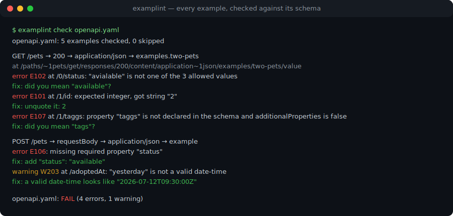
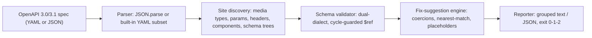

# examplint

[English](README.md) | [中文](README.zh.md) | [日本語](README.ja.md)

[](LICENSE)   [](CONTRIBUTING.md)

**An open-source, zero-dependency linter that validates every example in an OpenAPI spec against its declared schema — with a concrete fix suggestion for every mismatch.**



```bash
# not yet on npm — install from a checkout of this repository
npm install && npm run build && npm pack
npm install -g ./examplint-0.1.0.tgz
```

## Why examplint?

Spec examples drift. A field gets renamed, an enum value gets retyped from memory, an integer gets quoted during a merge — and none of it fails review, because examples are the one part of an OpenAPI document nothing executes. The rot then flows downstream into every consumer: generated docs show requests that would 400, mocked servers hand SDKs payloads that never validate, and the first person to notice is a customer. General-purpose spec linters focus on structure and style, and where they do check examples they stop at "does not validate against schema". examplint does one job completely: it finds **every** example in the document — media types, named `examples` maps, parameters, headers, `components`, webhooks, and the schema-level `example`/`examples`/`default` values that other tools walk right past — validates each against the exact schema that governs it, and attaches a concrete fix (`did you mean "available"?`, `unquote it: 25`, `add "status": "available"`) to every finding. Anything it cannot check is reported as a coded warning with the reason, never skipped silently.

|  | examplint | Spectral | openapi-examples-validator | Redocly CLI |
|---|---|---|---|---|
| Focus | examples-vs-schema conformance only | general ruleset linting | example validation | full API toolchain |
| Fix suggestions | on every derivable finding | no | no | no |
| Schema-level `example`/`examples[]` | yes, anywhere in a schema tree | rule for top-level schema examples | opt-in flag | partial |
| `default` values checked | yes (`--check-defaults`) | no | no | no |
| Unchecked examples surfaced | always, as coded warnings | no | no | no |
| Config required | none | ruleset file | CLI flags | config file |
| Runtime dependencies | 0 | ~25 | ~10 | ~50 |

<sub>Capability and dependency counts checked against each project's public docs and npm metadata, 2026-07.</sub>

## Features

- **Exhaustive example discovery** — media-type `example` and `examples` maps, parameter/header examples, request bodies, responses, `components.*`, webhooks, and schema-level `example`/`examples[]` nested at any depth; `examplint list` shows every site it found, with a JSON Pointer.
- **Fix suggestions, not just verdicts** — typo'd enum values and property names resolve to the nearest candidate, quoted numbers suggest unquoting, missing required properties get a schema-derived placeholder, failed formats show a valid sample, `oneOf` misses name the closest branch.
- **Both dialects, correctly** — OpenAPI 3.0 (`nullable`, boolean `exclusiveMaximum`, single-schema `items`) and 3.1 (type arrays, `const`, `prefixItems`, `contains`), with cycle-guarded `$ref` resolution so recursive schemas validate recursive data.
- **Nothing is skipped silently** — external refs, `externalValue` examples, non-JSON media types, unknown formats and schema-less examples each produce a stable-coded warning (W201–W209) saying exactly why they were not checked.
- **Built for CI** — deterministic output, `--format json`, `--strict`, and exit codes that distinguish findings (1) from usage errors (2); two locations per diagnostic (site pointer in the spec, instance path in the example) make findings scriptable and jumpable.
- **Zero runtime dependencies, fully offline** — Node.js is the only requirement; YAML and JSON parsing, validation and reporting are all in-repo, and the tool never opens a socket.

## Quickstart

Install:

```bash
# not yet on npm — install from a checkout of this repository
npm install && npm run build && npm pack
npm install -g ./examplint-0.1.0.tgz
```

Check the bundled drifted petstore — six months of unreviewed edits:

```bash
examplint check examples/drifted.yaml
```

Output (real captured run):

```text
examples/drifted.yaml: 5 examples checked, 0 skipped

GET /pets → param limit → example
  at /paths/~1pets/get/parameters/0/example
  error E101: expected integer, got string "25"
      fix: unquote it: 25

GET /pets → 200 → application/json → examples.two-pets
  at /paths/~1pets/get/responses/200/content/application~1json/examples/two-pets/value
  error E102 at /0/status: "avialable" is not one of the 3 allowed values
      fix: did you mean "available"?
  error E101 at /1/id: expected integer, got string "2"
      fix: unquote it: 2
  error E107 at /1/taggs: property "taggs" is not declared in the schema and additionalProperties is false
      fix: did you mean "tags"?

POST /pets → requestBody → application/json → example
  at /paths/~1pets/post/requestBody/content/application~1json/example
  error E106: missing required property "status"
      fix: add "status": "available"

POST /pets → 201 → application/json → example
  at /paths/~1pets/post/responses/201/content/application~1json/example
  warning W203 at /adoptedAt: "yesterday" is not a valid date-time
      fix: a valid date-time looks like "2026-07-12T09:30:00Z"

components.schemas.Pet → example
  at /components/schemas/Pet/example
  error E103 at /id: 0 is < the minimum 1
      fix: use a value >= 1

examples/drifted.yaml: FAIL (6 errors, 1 warning)
```

Exit code 1 — drop it into CI as-is. To see the full discovery surface (real captured run):

```bash
examplint list examples/drifted.yaml
```

```text
examples/drifted.yaml: 5 example sites
  GET /pets → param limit → example
    at /paths/~1pets/get/parameters/0/example [parameter-example]
  GET /pets → 200 → application/json → examples.two-pets
    at /paths/~1pets/get/responses/200/content/application~1json/examples/two-pets/value [named-example]
  ...
```

The clean twin `examples/petstore.yaml` exits 0 with `11 examples checked, 0 skipped`. More scenarios live in [examples/](examples/README.md).

## Rules

Errors (E1xx) mean an example does not conform to its schema; warnings (W2xx) mean something could not be fully checked — and examplint always says why. Codes are stable API, never renumbered. Full rationale per rule in [docs/rules.md](docs/rules.md).

| Rule | Severity | Checks |
|---|---|---|
| E101 | error | value type vs schema `type` (incl. 3.0 `nullable`, 3.1 type arrays) |
| E102 | error | `enum` membership and `const` equality |
| E103 | error | `minimum`/`maximum`/`exclusive*`/`multipleOf` |
| E104 | error | `minLength`/`maxLength`/`pattern` |
| E105 | error | `min/maxItems`, `uniqueItems`, `contains` |
| E106 | error | `required`, `dependentRequired`, property counts, `propertyNames` |
| E107 | error | undeclared properties under `additionalProperties: false` |
| E108 | error | `oneOf`/`anyOf`/`not` composition |
| W201–W209 | warning | everything that could not be checked, each with its reason |

## CLI reference

`examplint check <spec...>` validates (a bare path also works); `examplint list <spec...>` enumerates discovered sites. JSON or YAML input is sniffed from content — the built-in YAML subset covers real-world specs and rejects anchors/tags/multi-doc loudly (see [docs/yaml-support.md](docs/yaml-support.md)).

| Flag | Default | Effect |
|---|---|---|
| `--format text\|json` | `text` | report format; JSON is a stable shape for CI |
| `--strict` | off | warnings also fail the run (exit 1) |
| `--check-defaults` | off | validate schema `default` values like examples |
| `-q, --quiet` | off | per-file summary lines only |

Exit codes: `0` all examples conform, `1` findings (or warnings under `--strict`), `2` usage/parse/IO error — so scripts can tell a drifted spec from a broken invocation.

## Architecture



## Roadmap

- [x] Exhaustive example discovery, dual-dialect validator, 17-rule catalog, fix suggestions, YAML subset parser, JSON output (v0.1.0)
- [ ] `--fix`: apply safe suggestions back to the spec, format-preserving
- [ ] Coverage of `callbacks` and `links` path items
- [ ] Multi-file specs: follow relative `$ref`s across local files
- [ ] Watch mode for spec-heavy repos (`--watch`)

See the [open issues](https://github.com/JaydenCJ/examplint/issues) for the full list.

## Contributing

Contributions are welcome. Build with `npm install && npm run build`, then run `npm test` (90 tests) and `bash scripts/smoke.sh` (must print `SMOKE OK`) — this repository ships no CI, every claim above is verified by local runs. See [CONTRIBUTING.md](CONTRIBUTING.md), grab a [good first issue](https://github.com/JaydenCJ/examplint/issues?q=is%3Aissue+is%3Aopen+label%3A%22good+first+issue%22), or start a [discussion](https://github.com/JaydenCJ/examplint/discussions).

## License

[MIT](LICENSE)
