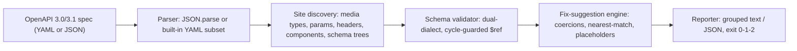

# examplint

[English](README.md) | [中文](README.zh.md) | [日本語](README.ja.md)

[](LICENSE)   [](CONTRIBUTING.md)

**一个开源、零依赖的 linter：把 OpenAPI 规范里的每一个 example 逐一对照其声明的 schema 做校验——并为每处不匹配给出具体的修复建议。**


```bash
# not yet on npm — install from a checkout of this repository
npm install && npm run build && npm pack
npm install -g ./examplint-0.1.0.tgz
```

## 为什么选择 examplint？

规范里的 example 会悄悄腐烂。字段被重命名、枚举值凭记忆重打了一遍、合并时整数被加上了引号——而这一切都能通过评审，因为 example 是 OpenAPI 文档里唯一没有任何东西去执行的部分。腐烂随后流向每一个下游消费者：生成的文档展示着会返回 400 的请求，mock 服务器把永远校验不过的负载塞给 SDK，第一个发现问题的人是客户。通用的规范 linter 关注结构与风格，即便检查 example 也止步于"不符合 schema"。examplint 把一件事做完整：找出文档里的**每一个** example——媒体类型、命名 `examples` 映射、参数、header、`components`、webhook，以及其他工具直接略过的 schema 级 `example`/`examples`/`default` 值——逐一对照管辖它的确切 schema 校验，并给每条发现附上具体修复（`did you mean "available"?`、`unquote it: 25`、`add "status": "available"`）。凡是无法检查的内容都以带编号的警告说明原因，绝不无声跳过。

|  | examplint | Spectral | openapi-examples-validator | Redocly CLI |
|---|---|---|---|---|
| 专注点 | 仅做 example 与 schema 的一致性 | 通用规则集 lint | example 校验 | 完整 API 工具链 |
| 修复建议 | 凡能推导必给出 | 无 | 无 | 无 |
| schema 级 `example`/`examples[]` | 是，schema 树内任意位置 | 仅顶层 schema example 规则 | 需显式开启 | 部分 |
| 校验 `default` 值 | 是（`--check-defaults`） | 否 | 否 | 否 |
| 未检查的 example 是否披露 | 始终以编号警告披露 | 否 | 否 | 否 |
| 是否需要配置 | 无 | 规则集文件 | CLI 参数 | 配置文件 |
| 运行时依赖 | 0 | 约 25 | 约 10 | 约 50 |

<sub>各项能力与依赖数量均对照各项目公开文档及 npm 元数据核实，2026-07。</sub>

## 功能特性

- **穷尽式 example 发现** —— 媒体类型的 `example` 与 `examples` 映射、参数/header 示例、请求体、响应、`components.*`、webhook，以及嵌套在任意深度的 schema 级 `example`/`examples[]`；`examplint list` 会列出找到的每一处位置，并附 JSON Pointer。
- **给修复建议，而非只下结论** —— 打错的枚举值和属性名解析到最近的候选，被加引号的数字建议去引号，缺失的必填属性得到由 schema 推导的占位值，格式不符展示一个合法样例，`oneOf` 不中时指出最接近的分支。
- **两种方言都正确支持** —— OpenAPI 3.0（`nullable`、布尔型 `exclusiveMaximum`、单 schema `items`）与 3.1（类型数组、`const`、`prefixItems`、`contains`），`$ref` 解析带环路保护，递归 schema 可以校验递归数据。
- **绝不无声跳过** —— 外部引用、`externalValue` 示例、非 JSON 媒体类型、未知 format、无 schema 的 example，各自产生一条编号稳定的警告（W201–W209），说明为何未检查。
- **为 CI 而生** —— 输出确定性、`--format json`、`--strict`，退出码区分发现（1）与用法错误（2）；每条诊断带两个位置（规范内的 site pointer、example 内的 instance path），可脚本化、可直接跳转。
- **零运行时依赖，完全离线** —— 只需要 Node.js；YAML 与 JSON 解析、校验、报告全部内置，工具从不打开任何 socket。

## 快速上手

安装：

```bash
# not yet on npm — install from a checkout of this repository
npm install && npm run build && npm pack
npm install -g ./examplint-0.1.0.tgz
```

检查随附的漂移版 petstore——六个月无人评审的编辑：

```bash
examplint check examples/drifted.yaml
```

输出（真实运行捕获）：

```text
examples/drifted.yaml: 5 examples checked, 0 skipped

GET /pets → param limit → example
  at /paths/~1pets/get/parameters/0/example
  error E101: expected integer, got string "25"
      fix: unquote it: 25

GET /pets → 200 → application/json → examples.two-pets
  at /paths/~1pets/get/responses/200/content/application~1json/examples/two-pets/value
  error E102 at /0/status: "avialable" is not one of the 3 allowed values
      fix: did you mean "available"?
  error E101 at /1/id: expected integer, got string "2"
      fix: unquote it: 2
  error E107 at /1/taggs: property "taggs" is not declared in the schema and additionalProperties is false
      fix: did you mean "tags"?

POST /pets → requestBody → application/json → example
  at /paths/~1pets/post/requestBody/content/application~1json/example
  error E106: missing required property "status"
      fix: add "status": "available"

POST /pets → 201 → application/json → example
  at /paths/~1pets/post/responses/201/content/application~1json/example
  warning W203 at /adoptedAt: "yesterday" is not a valid date-time
      fix: a valid date-time looks like "2026-07-12T09:30:00Z"

components.schemas.Pet → example
  at /components/schemas/Pet/example
  error E103 at /id: 0 is < the minimum 1
      fix: use a value >= 1

examples/drifted.yaml: FAIL (6 errors, 1 warning)
```

退出码为 1——原样放进 CI 即可。想看完整的发现面（真实运行捕获）：

```bash
examplint list examples/drifted.yaml
```

```text
examples/drifted.yaml: 5 example sites
  GET /pets → param limit → example
    at /paths/~1pets/get/parameters/0/example [parameter-example]
  GET /pets → 200 → application/json → examples.two-pets
    at /paths/~1pets/get/responses/200/content/application~1json/examples/two-pets/value [named-example]
  ...
```

干净的孪生版 `examples/petstore.yaml` 以 `11 examples checked, 0 skipped` 退出 0。更多场景见 [examples/](examples/README.md)。

## 规则

错误（E1xx）表示 example 不符合其 schema；警告（W2xx）表示某处未能完整检查——examplint 总会说明原因。编号是稳定 API，永不重排。每条规则的完整说明见 [docs/rules.md](docs/rules.md)。

| 规则 | 严重级 | 检查内容 |
|---|---|---|
| E101 | error | 值类型与 schema `type`（含 3.0 `nullable`、3.1 类型数组） |
| E102 | error | `enum` 成员资格与 `const` 相等性 |
| E103 | error | `minimum`/`maximum`/`exclusive*`/`multipleOf` |
| E104 | error | `minLength`/`maxLength`/`pattern` |
| E105 | error | `min/maxItems`、`uniqueItems`、`contains` |
| E106 | error | `required`、`dependentRequired`、属性数量、`propertyNames` |
| E107 | error | `additionalProperties: false` 下的未声明属性 |
| E108 | error | `oneOf`/`anyOf`/`not` 组合 |
| W201–W209 | warning | 所有未能检查的内容，每条附原因 |

## CLI 参考

`examplint check <spec...>` 执行校验（直接给路径也行）；`examplint list <spec...>` 枚举发现的位置。JSON 或 YAML 按内容嗅探——内置的 YAML 子集覆盖现实中的规范写法，并对锚点/标签/多文档大声报错（见 [docs/yaml-support.md](docs/yaml-support.md)）。

| 参数 | 默认值 | 效果 |
|---|---|---|
| `--format text\|json` | `text` | 报告格式；JSON 为面向 CI 的稳定结构 |
| `--strict` | 关 | 警告也使运行失败（退出 1） |
| `--check-defaults` | 关 | 把 schema 的 `default` 值当作 example 校验 |
| `-q, --quiet` | 关 | 每个文件只输出摘要行 |

退出码：`0` 所有 example 均符合，`1` 有发现（或 `--strict` 下有警告），`2` 用法/解析/IO 错误——脚本因此能区分"规范漂移了"和"调用方式错了"。

## 架构



## 路线图

- [x] 穷尽式 example 发现、双方言校验器、17 条规则目录、修复建议、YAML 子集解析器、JSON 输出（v0.1.0）
- [ ] `--fix`：把安全的建议直接写回规范，保持原格式
- [ ] 覆盖 `callbacks` 与 `links` 路径项
- [ ] 多文件规范：跨本地文件跟随相对 `$ref`
- [ ] 面向规范密集仓库的监视模式（`--watch`）

完整列表见 [open issues](https://github.com/JaydenCJ/examplint/issues)。

## 参与贡献

欢迎贡献。先 `npm install && npm run build` 构建，再运行 `npm test`（90 个测试）和 `bash scripts/smoke.sh`（必须打印 `SMOKE OK`）——本仓库不带 CI，上述每项声明都由本地运行验证。参见 [CONTRIBUTING.md](CONTRIBUTING.md)，认领一个 [good first issue](https://github.com/JaydenCJ/examplint/issues?q=is%3Aissue+is%3Aopen+label%3A%22good+first+issue%22)，或发起一个 [discussion](https://github.com/JaydenCJ/examplint/discussions)。

## 许可证

[MIT](LICENSE)
